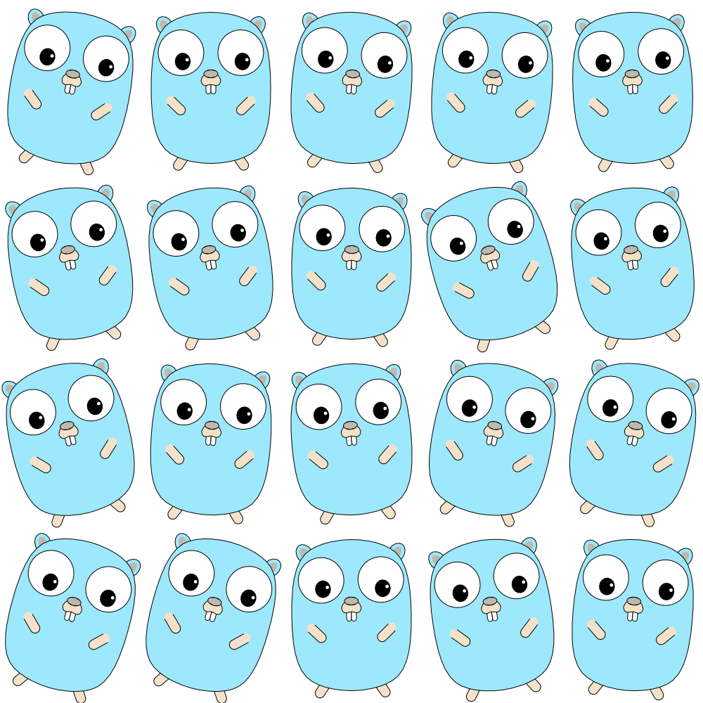

# Yet Another 2D Graphics Package For Go

Dancing gophers rendered with graphics2d primitives.

The top level Path and Shape types are complete, and the majority of PathProcessors implemented, including:
- StrokeProc - fixed width strokes with a variety of cap and join types.
- SnipProc - chops up a path according to a pattern
- DashProc - wrapper around SnipProc for creating a dashed path
- CompoundProc - allows concatenation of PathProcessors
> dashedstroke := NewCompoundProc(NewDashProc(pattern, offs), NewStrokeProc(1))

Wiki entries [here](https://github.com/jphsd/graphics2d/wiki)
