# Yet Another 2D Graphics Package For Go

[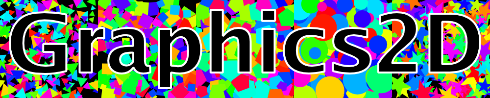](https://pkg.go.dev/github.com/jphsd/graphics2d#example-package-Splash)

## 1. Introduction

[Graphics2D](https://pkg.go.dev/github.com/jphsd/graphics2d) is a vector based drawing package that
leverages [golang.org/x/image/vector](https://pkg.go.dev/golang.org/x/image/vector) to render shapes into an image.

The vector package extends [image/draw](https://pkg.go.dev/image/draw) to create a mask that a source image
is rendered through into the destination image.
Graphics2D follows this convention.

All the pictures and diagrams in this README were created with this package.
Clicking on one will take you to the code that created it.

### Paths

The primary type in the package is the [Path](https://pkg.go.dev/github.com/jphsd/graphics2d#Path).
A path represents a single movement of a pen, from pen down to pen up. Paths are composed of steps with
some number of points in them.
The number of points determines the order of the Bezier curve generated.
The path methods [LineTo](https://pkg.go.dev/github.com/jphsd/graphics2d#Path.LineTo)
and [CurveTo](https://pkg.go.dev/github.com/jphsd/graphics2d#Path.CurveTo)
are just synonyms for [AddStep](https://pkg.go.dev/github.com/jphsd/graphics2d#Path.AddStep).
Once created, a path can be left as is (open), or closed [Close](https://pkg.go.dev/github.com/jphsd/graphics2d#Path).
A closed path can no longer be extended and a line is automatically created from
the first point in the path to its last.

### Shapes

Shapes allow multiple paths to be combined to produce more complex drawings.
For example, the figure 8 is composed of three paths; its external outline, and the two holes in it.

### Rendering

Shapes are rendered to an image using a source filler image and the mask generated from the shape by
[RenderShape](https://pkg.go.dev/github.com/jphsd/graphics2d#RenderShape).
If the filler is all one color,
then [RenderColoredShape](https://pkg.go.dev/github.com/jphsd/graphics2d#RenderColoredShape)
can be used.

## 2. Basic Shapes
[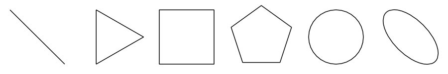](https://pkg.go.dev/github.com/jphsd/graphics2d#example-package-Fig01)

These shapes were created using [Line](https://pkg.go.dev/github.com/jphsd/graphics2d#Path.Line),
[RegularPolygon](https://pkg.go.dev/github.com/jphsd/graphics2d#Path.RegularPolygon),
[Circle](https://pkg.go.dev/github.com/jphsd/graphics2d#Path.Circle),
and [Oval](https://pkg.go.dev/github.com/jphsd/graphics2d#Path.Oval).
These are just some of the constructors available for the Path type.

## 3. Bezier Curves
[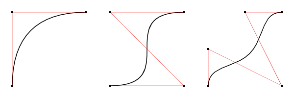](https://pkg.go.dev/github.com/jphsd/graphics2d#example-package-Fig02)

[Bezier curves](https://en.wikipedia.org/wiki/B%C3%A9zier_curve)
are polynomial curves.
Most vector packages support first, second and third order curves; lines, quadratic and cubic curves respectively.
The path AddStep method has no upper limit on the number of control points that can be specified so higher
order curves can be created.
The last example on the right is a quartic curve.

## 4. Arcs And ArcStyles
[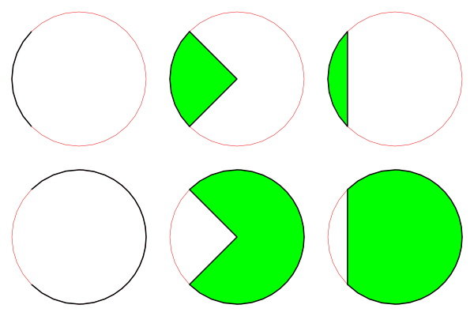](https://pkg.go.dev/github.com/jphsd/graphics2d#example-package-Fig03)

Various arc path constructors are available and typically take a start angle and a sweep angle.
The sign of the sweep angle determines whether it goes clockwise or counter-clockwise.
The arcs are approximated from cubic Bezier curves. 
Arcs must have an [ArcStyle](https://pkg.go.dev/github.com/jphsd/graphics2d#ArcStyle)
associated with them, one of ArcOpen, ArcPie or ArcChord as shown above.

## 5. Reentrant Shapes
[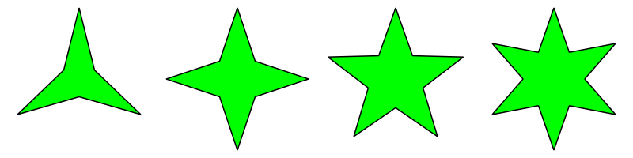](https://pkg.go.dev/github.com/jphsd/graphics2d#example-package-Fig04)

Examples of different regular reentrant polygons made with [ReentrantPolygon](https://pkg.go.dev/github.com/jphsd/graphics2d#ReentrantPolygon).
The degree of reentrancy is controlled by a value in the range \[0,1) where 0 represents a regular polygon and 1,
a polygon with no area.
A value of 0.5 was used for these polygons.

## 6. Using Path Processors
[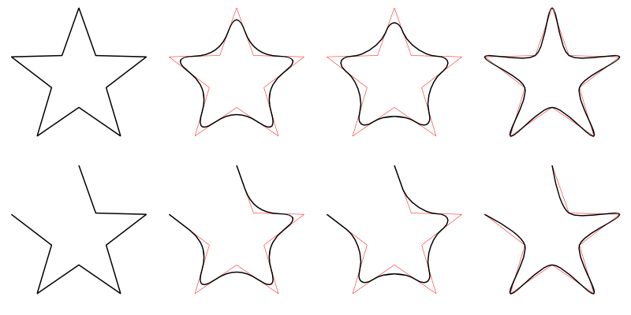](https://pkg.go.dev/github.com/jphsd/graphics2d#example-package-Fig05)

Paths have a [Process](https://pkg.go.dev/github.com/jphsd/graphics2d#Path.Process)
method that allows a [PathProcessor](https://pkg.go.dev/github.com/jphsd/graphics2d#PathProcessor)
to be applied to them which will generate one or more new paths.
This example shows what the effect of the [CurveProc](https://pkg.go.dev/github.com/jphsd/graphics2d#CurveProc)
looks like applied to both a closed and an open path made up of multiple line segments.
CurveProc requires a [CurveStyle](https://pkg.go.dev/github.com/jphsd/graphics2d#CurveStyle)
to be specified too, one of Quad, Bezier or CatmullRom (L to R in the example).

[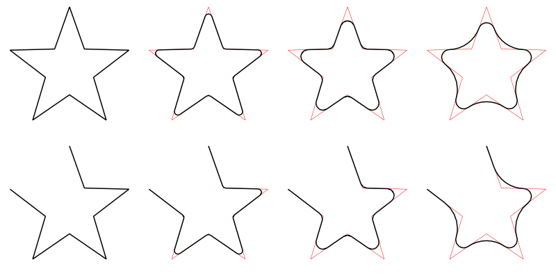](https://pkg.go.dev/github.com/jphsd/graphics2d#example-package-Fig06)

Another path processor that can be used to create curved paths is [RoundedProc](https://pkg.go.dev/github.com/jphsd/graphics2d#RoundedProc).
This example uses increasing curve radii from L to R.

Shapes have a similar function [ProcessPaths](https://pkg.go.dev/github.com/jphsd/graphics2d#Shape.ProcessPaths)
which runs a path processor over all of the paths in a shape.

## 7. Using Fonts

The [golang.org/x/image/font/sfnt](https://pkg.go.dev/golang.org/x/image/font/sfnt)
package can read in and parse TrueType and OpenType fonts.
Strings can be turned into shapes using a parsed font and [StringToShape](https://pkg.go.dev/github.com/jphsd/graphics2d#StringToShape).
The shape will be in font units.
[ScaleAndInset](https://pkg.go.dev/github.com/jphsd/graphics2d#ScaleAndInset)
can be used to fit the result to the desired location.
This example also uses path processors to show the control points for the font curves.

## 8. Dashing With Path Processors
[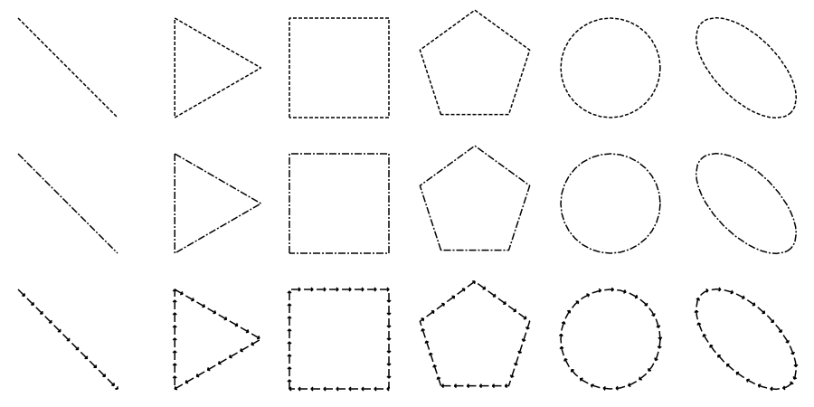](https://pkg.go.dev/github.com/jphsd/graphics2d#example-package-Fig08)

These were created from the paths in the earlier example using the [DashProc](https://pkg.go.dev/github.com/jphsd/graphics2d#DashProc)
path processor.
The dash patterns are {4, 2}, {8, 2, 2, 2} and {10, 4}.
The bottom row also uses another path processor,
[CapsProc](https://pkg.go.dev/github.com/jphsd/graphics2d#CapsProc),
on the paths from running DashProc, to add the arrow heads.

## 9. Tracing With Path Processors
[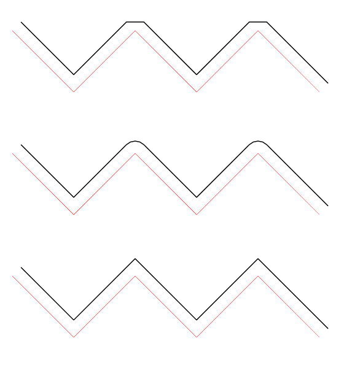](https://pkg.go.dev/github.com/jphsd/graphics2d#example-package-Fig09)

The [TraceProc](https://pkg.go.dev/github.com/jphsd/graphics2d#TraceProc)
path processor traces a path,
either to the left or the right of the original, depending on the offset value supplied.
How path steps are joined is specified by a join function that the processor calls.
The following functions are shown:
[JoinButt](https://pkg.go.dev/github.com/jphsd/graphics2d#JoinButt),
[JoinRound](https://pkg.go.dev/github.com/jphsd/graphics2d#JoinRound), and
[JoinMiter](https://pkg.go.dev/github.com/jphsd/graphics2d#MiterJoin.JoinMiter).

[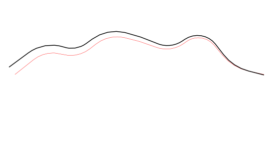](https://pkg.go.dev/github.com/jphsd/graphics2d#example-package-Fig10)

A variable width trace path processor,
[VWTraceProc](https://pkg.go.dev/github.com/jphsd/graphics2d#VWTraceProc),
uses the distance along the path, t (range \[0,1\]), to figure the current offset of the trace.
This example uses `(1-t) * offset` as the offset function.
The joins are all miter joins, implicitly.

## 10. Outlining With Stroke Path Processor
[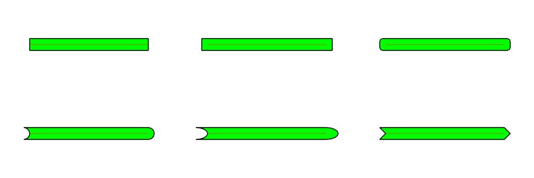](https://pkg.go.dev/github.com/jphsd/graphics2d#example-package-Fig11)

The [StrokeProc](https://pkg.go.dev/github.com/jphsd/graphics2d#StrokeProc)
is used to convert open paths to closed ones,
since only closed paths can be filled by the renderer.

A stroke is comprised of left and right trace path processors,
and functions that define the start and end caps of the path.

This example shows the [CapButt](https://pkg.go.dev/github.com/jphsd/graphics2d#CapButt),
[CapSquare](https://pkg.go.dev/github.com/jphsd/graphics2d#CapSquare),
[CapRoundedSquare](https://pkg.go.dev/github.com/jphsd/graphics2d#RSCap,CapRoundedSquare),
[CapInvRound](https://pkg.go.dev/github.com/jphsd/graphics2d#CapInvRound) and
[CapRound](https://pkg.go.dev/github.com/jphsd/graphics2d#CapRound),
[CapInvOval](https://pkg.go.dev/github.com/jphsd/graphics2d#OvalCap.CapInvOval) and
[CapOval](https://pkg.go.dev/github.com/jphsd/graphics2d#OvalCap.CapOval), and
[CapInvPoint](https://pkg.go.dev/github.com/jphsd/graphics2d#CapInvPoint) and
[CapPoint](https://pkg.go.dev/github.com/jphsd/graphics2d#CapPoint),
from left to right.

End caps are only used when the path is open.
When a stroke processor is applied to a closed path,
two closed paths are created forming an outline of the original.

## 11. Pens

A [Pen](https://pkg.go.dev/github.com/jphsd/graphics2d#Pen)
is a convenient abstraction that ties together a filler image, a path processor, and a transform.
The path processor creates the closed paths needed for rendering,
so that the user doesn't have to write the mechanics of outlining for every shape.
The transform is applied to the shape prior to the path processor so a pen with width 1, for example,
will draw paths with width 1 in the image and not the shape coordinates.
A predefined collection of colored pens is available
[here](https://pkg.go.dev/github.com/jphsd/graphics2d#pkg-variables).
Dashed pens can be constructed by concatenating DashProc with the path processor.
See the pen [example](https://pkg.go.dev/github.com/jphsd/graphics2d#example-Pen).

Convenience functions that take a pen argument are:
- [DrawArc](https://pkg.go.dev/github.com/jphsd/graphics2d#DrawArc)
- [DrawLine](https://pkg.go.dev/github.com/jphsd/graphics2d#DrawLine)
- [DrawPath](https://pkg.go.dev/github.com/jphsd/graphics2d#DrawPath)
- [DrawPoint](https://pkg.go.dev/github.com/jphsd/graphics2d#DrawPoint)
- [DrawShape](https://pkg.go.dev/github.com/jphsd/graphics2d#DrawShape)

## 12. Gradients
[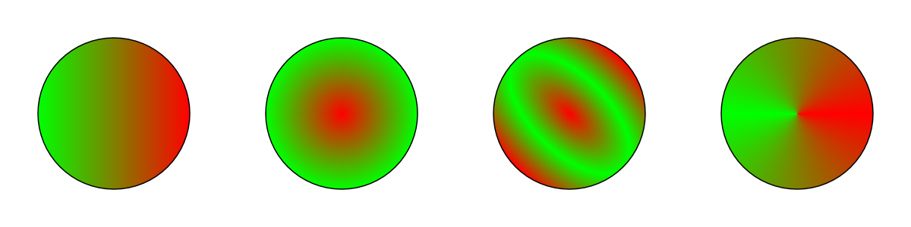](https://pkg.go.dev/github.com/jphsd/graphics2d#example-package-Fig12)

Gradients aren't strictly part of the graphics2d package since what's used to fill a shape is just an image.
Gradient images can be created using the [texture](https://pkg.go.dev/github.com/jphsd/texture) package.
This package supports linear, radial, elliptical and conic gradients with convenience functions for gray scale
and RGBA images.
The gradients can be set to repeat and to mirror.
The RGBA gradients are just [Colorizer](https://pkg.go.dev/github.com/jphsd/graphics2d/image#Colorizer)
wrappers around their Gray16 counterparts,
allowing for multiple color stops in the gradient.

List of gradient image functions:
- [NewLinearGray16](https://pkg.go.dev/github.com/jphsd/texture#NewLinearGray16)
- [NewRadialGray16](https://pkg.go.dev/github.com/jphsd/texture#NewRadialGray16)
- [NewEllipticalGray16](https://pkg.go.dev/github.com/jphsd/texture#NewEllipticalGray16)
- [NewConicGray16](https://pkg.go.dev/github.com/jphsd/texture#NewConicGray16)
- [NewLinearRGBA](https://pkg.go.dev/github.com/jphsd/texture#NewLinearRGBA)
- [NewRadialRGBA](https://pkg.go.dev/github.com/jphsd/texture#NewRadialRGBA)
- [NewEllipticalRGBA](https://pkg.go.dev/github.com/jphsd/texture#NewEllipticalRGBA)
- [NewConicRGBA](https://pkg.go.dev/github.com/jphsd/texture#NewConicRGBA)
